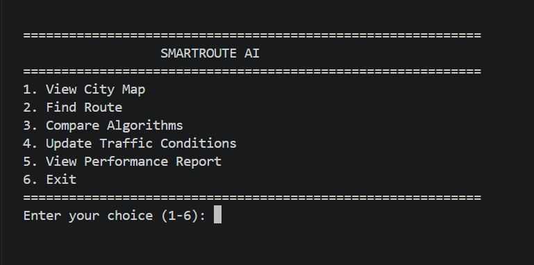
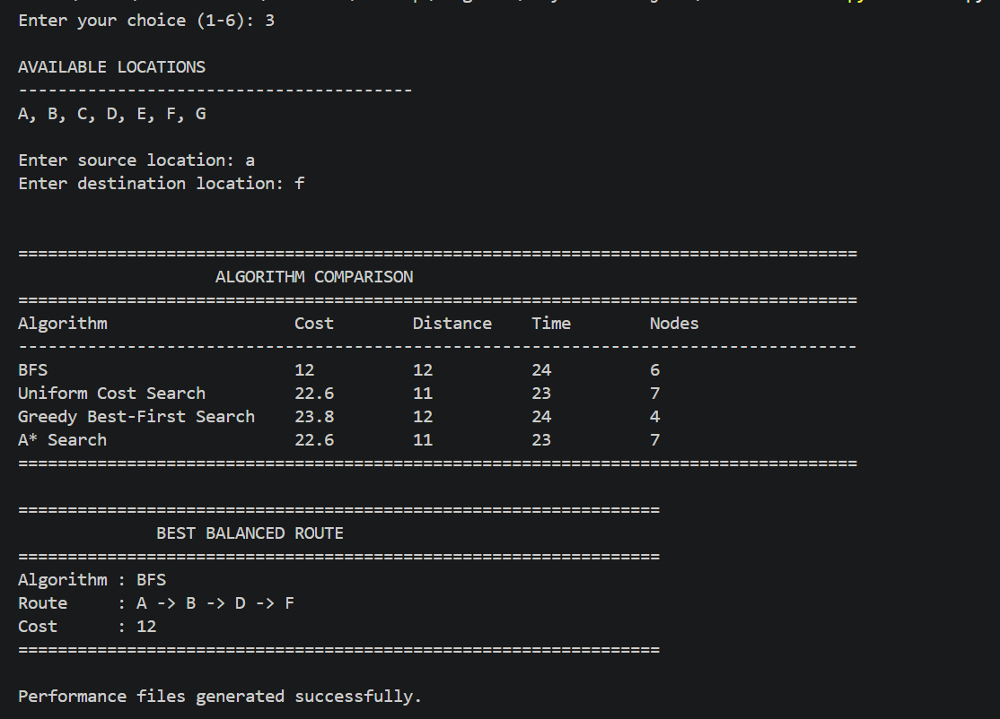
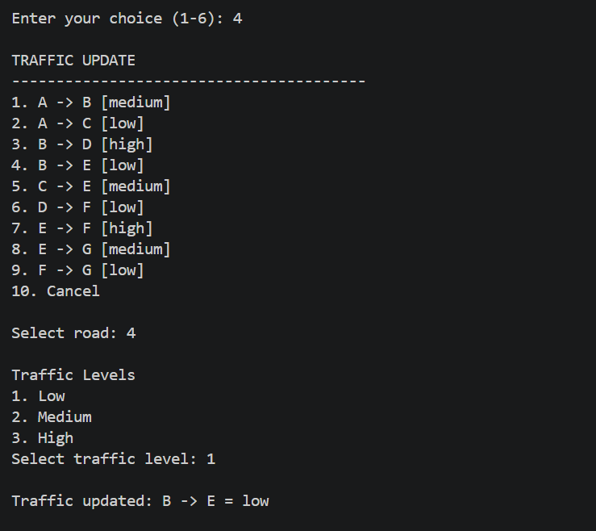
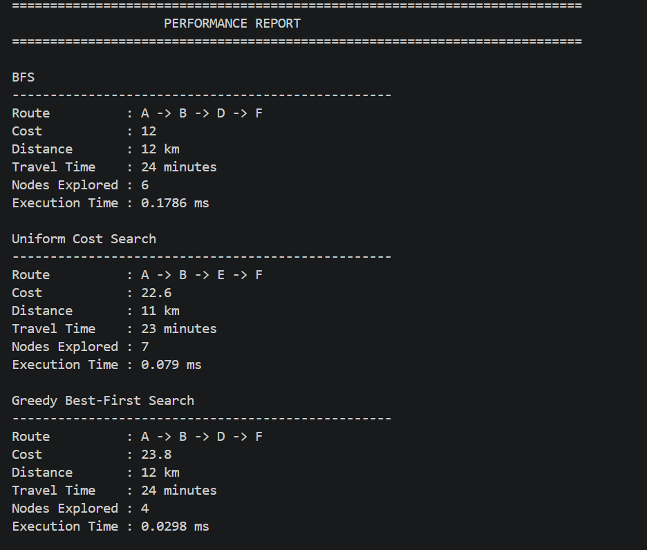

# SmartRoute AI

An AI-based intelligent route optimization system that applies classical search algorithms to find and compare routes in a traffic-aware road network.

---

## 1. Project Overview

SmartRoute AI is a command-line route optimization system developed using Artificial Intelligence search techniques.

The system represents a road network as a graph where locations are represented as nodes and roads are represented as connections between nodes. It applies multiple search strategies to determine routes between a source and destination.

The implemented algorithms are:

- Breadth-First Search (BFS)
- Uniform Cost Search (UCS)
- Greedy Best-First Search
- A* Search

The system also incorporates road distance, estimated travel time, and traffic conditions into route evaluation. Users can compare the performance of different algorithms and select their preferred optimization objective.

---

## 2. Key Features

### Multiple Search Algorithms

The system implements:

- Breadth-First Search (BFS)
- Uniform Cost Search (UCS)
- Greedy Best-First Search
- A* Search

### Traffic-Aware Routing

Each road contains:

- Distance
- Travel time
- Traffic level

Traffic levels include:

- Low
- Medium
- High

### Dynamic Traffic Updates

Users can modify the traffic condition of roads while the application is running.

### Optimization Preferences

Users can select:

- Minimum Distance
- Minimum Travel Time
- Minimum Traffic
- Balanced Route

### Algorithm Comparison

The system compares algorithms using:

- Route
- Cost
- Distance
- Travel time
- Nodes explored
- Execution time

### Performance Analysis

Performance data can be saved as a JSON report and visualized using graphs.

### Automated Testing

The project includes test cases for the implemented search algorithms and important edge cases.

### Command-Line Interface

The complete application can be executed through a terminal without requiring a GUI.

---

## 3. Technologies / Tools Used

### Programming Language

- Python

### Libraries

- Matplotlib
- Python Standard Library
- unittest

### Data Format

- JSON

### Development Tools

- Visual Studio Code
- Git
- GitHub

---

## 4. Installation & Running

### Prerequisites

The following software is required:

- Python 3.9 or higher
- pip
- Git

## 5. Testing

The project includes automated test cases to verify the functionality of the implemented search algorithms and important edge cases.

## 6. Screenshots

### 6.1 Main Menu

The SmartRoute AI application provides a command-line interface through which users can access route optimization, traffic updates, algorithm comparison, and performance analysis features.

### 6.2 Route Optimization

The system accepts a source and destination and calculates an optimized route using the selected search algorithm.

### 6.3 Traffic-Aware Routing

The system incorporates traffic conditions into the route cost calculation to support traffic-aware route selection.

### 6.4 Algorithm Comparison

The application compares BFS, Uniform Cost Search, Greedy Best-First Search, and A* Search using route and performance metrics.

### 6.5 Performance Analysis

The generated performance results allow comparison of the implemented algorithms based on metrics such as execution time, nodes explored, and route cost.

